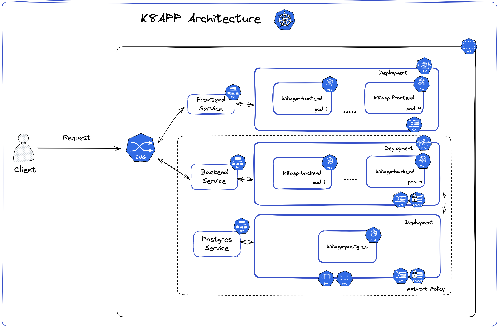

# Kubernetes frontend backend example

Simple containerized application with Kubernetes.
This is a **TodoList application** which has **backend, frontend and database** deployed using Kubernetes.

This example can be deployed in GCP (Google Cloud Platform) and microk8s.

### Project structure
1) MicroK8s version located in `k8s-microk8s` folder
2) Google Cloud Platform (GCP) version located in `k8s-gcp` folder
3) Helm charts are located in  `k8s-microk8s-chart` and `k8s-gcp-chart` folders correspondingly

**You can find running example website in Google Cloud Platform using links below**:

* Frontend: http://www.k8s.codes/
* Backend: http://www.k8s.codes/api

As we don't have wildcard SSL certificate, for GCP version we set an Ingress prefix for our Backend on `/api` path. For
better Separation of Concerns, in our microk8s version Backend is located at `http://backend.k8app.com`.

While following `HTTP` links mentioned above notice automatic redirects to `HTTPS`.

## Kubernetes

### Architecture



This section provides information on the location and purpose of Kubernetes-related files.

### `k8s-gcp/` folder

The `k8s-gcp/` folder contains artifacts for deployment using Google Cloud Platform. These artifacts will aid in the
deployment process on GCP and ensure proper configuration of your Kubernetes objects. These are the files that were
presented in the Team Presentation.

### `k8s-gcp-chart/` folder

The `k8app-charts/` folder contains artifacts to assist in the creation of Helm charts using the command helm install
k8app ./k8app-chart. These artifacts will help to streamline the deployment process for your Kubernetes application.

### `k8-microk8s/` folder

The `k8-specs/` folder contains artifacts for creating Kubernetes objects using the command kubectl apply -f k8-specs.
It is important to note that Minikube in macOS does not currently support DNS resolution, so it is strongly recommended
to use Microk8s instead.

### `k8app-charts/` folder

The `k8app-charts/` folder contains artifacts to assist in the creation of Helm charts using the command helm install
k8app ./k8app-chart. These artifacts will help to streamline the deployment process for your Kubernetes application.

### Roles

We defined the following roles:

- Developer
    - Can fully manage configmaps, services, pods, and secrets in the default namepsace
    - Test commands:
        - ```kubectl auth can-i list pod --namespace default --as user_developer```
            - Expected answer is ```yes```
        - ```kubectl auth can-i list deploy --namespace default --as user_developer```
            - Expected answer is ```no```
- Devops
    - Can fully manage ingress, deployments, cert-manager, replicaset, and secrets in the default namepsace
    - Test commands:
        - ```kubectl auth can-i list deploy --namespace default --as user_devops```
            - Expected answer is ```yes```
        - ```kubectl auth can-i list pod --namespace default --as user_devops```
            - Expected answer is ```no```
- Security
    - Can fully manage configmaps and secrets in all namespaces
    - Test commands:
        - ```kubectl auth can-i list secrets --namespace default --as user_security```
            - Expected answer is ```yes```
        - ```kubectl auth can-i list deploy --namespace default --as user_security```
            - Expected answer is ```no```

## Setup using microk8s

### Local DNS settings

In order to ensure that the application works on local version it is necessary to add the following lines to your
/etc/hosts file (or equivalent on a non Linux based OS):

```
127.0.0.1 k8app.com
127.0.0.1 backend.k8app.com
```

1) Start microk8s: ```microk8s start```
2) Enable dns: ```microk8s enable dns```
3) Enable cert-manager: ```microk8s enable cert-manager```
4) Enable ingress: ```microk8s enable ingress```
5) Enable ha-cluster: ```microk8s enable ha-cluster```
6) Enable observability: ```microk8s enable observability```
7) Enable rbac: ```microk8s enable rbac```
8) You then have two choices for deploying the application, either using K8s directly or using helm
    1) **Using K8s directly:** Navigate to ```k8s-microk8s``` folder and run:
        - ```microk8s kubectl apply -f .``` to install the application
        - ```microk8s kubectl delete -f .``` to uninstall the application
        - ```microk8s kubectl apply -f .``` to upgrade the application, when there is a change that can take effect, it
          will.
    1) **Using helm:** Navigate to the root folder of this repository:
        - ```microk8s helm3 install k8app k8s-microk8s-chart/``` to install the application
        - ```microk8s helm3 uninstall k8app``` to uninstall the application
        - ```microk8s helm3 upgrade k8app k8s-microk8s-chart/``` to upgrade the application, when there is a change that
          can take effect, it will.

9) Follow https://backend.k8app.com for backend and https://k8app.com for frontend

*Note*: Due to the fact that we are using a wildcard certificate from a self-created certificate authority, it is
necessary to navigate to the backend first and trust the certificate there before going to the frontend. If this is not
done the frontend will appear empty until you trust the certificate from the backend.

## Setup using Google Cloud

`k8s-gcp` contains YAML files that are GCP used for GCP deployment.
`k8s-gcp-chart` contains Helm charts that can be used to deploy on GCP.

To set up dependencies - consult
this [guide](https://cloud.google.com/kubernetes-engine/docs/how-to/cluster-access-for-kubectl)

Note: building frontend image for GCP can be tricky, as is case image is not build with amd64 architecture there may be
problems with running it properly. For this reason `buildx` with `--platform=linux/amd64` flag can be used to be double
sure it is properly build.

1) You can build a docker image using `build_and_push_docker.sh` or by running `docker-compose build`.     
   In case you want to build with `buildx`
   use: `docker buildx build frontend -f frontend/frontend.dockerfile -t kotonium/k8app-frontend-image:1.2 --platform=linux/amd64`
2) You have to be logged in with` gcloud auth login {username}`. Verify that log-in was successful with
   running `gcloud auth list`.
3) Connect to GCP cluster and configure local kubectl with command that is copied from GCP and looks
   like: `gcloud container clusters get-credentials {cluster-name} --region {region_where_cluster_is_located}`

4) Deploy kubernetes cluster to GCP using Helm with
   ```bash
   helm install k8s-app k8s-gcp-chart
   ```
5) As we have configured a real domain with SSL, after Ingress IP is issued, update the DNS routing to IP of Ingress.
6) You are done. Follow the Frontend and Backend links and see them in action!

## Setup using Minikube

1) Enable minikube to see local Docker images: ```eval $(minikube -p minikube docker-env)```
2) Rebuild the docker images so now minikube sees them ```docker-compose build```
3) To enable the NGINX Ingress controller, run the following command: ```minikube addons enable ingress```.
4) Install metrics server for
   minikube ```kubectl apply -f https://github.com/kubernetes-sigs/metrics-server/releases/latest/download/components.yaml```
   so minikube can measure utilization of deployment (needed for HPA)
5) Navigate to ```k8s``` folder and run ```kubectl delete -f .;kubectl apply -f .```
6) Create a tunnel to load balancer with minikube: ```minikube service lb-backend``` or ```minikube tunnel lb-backend```
7) Follow generate tunnel URI with to see backend container
8) As there is no proper DNS resolution supported by minikube yet, it is not possible to proceed further

### How to make a rollout

- Make a change in your deployment file (Change the image tag or the limits)
- Create configmaps.
- Execute `kubectl apply -f [FILE_NAME]`
- Validate rollout satus with `kubectl rollout status deployment/[DEPLOYMEN_TNAME]`
- Get rollout history with `kubectl rollout history deployment/[DEPLOYMENT_NAME]`
- Go back to a specific revosion `kubectl rollout undo deployment/[DEPLOYMENT_NAME] --to-revision=1`

### How to make a canary deployment

- Execute `kubectl apply -f k8s-microk8s/frontend-deployment-canary-v1.yml`
- Execute `kubectl apply -f k8s-microk8s/frontend-deployment-canary-v2.yml`
- Scale down v1 `kubectl scale --replicas=9 k8app-frontend-v1`
- Delete deployment v1 `kubectl delete -f k8s-microk8s/frontend-deployment-canary-v1.yml`

## Docker:

### Docker Compose:

For convenience of performing builds and making very first test runs, we also created docker-compose file that make use
of 2 custom images and a Postgres database.

To run our docker-compose implementation:

1) Go inside k8app (root project) folder
2) Run ```docker-compose up```
3) Navigate to **frontend** http://localhost:5000/
4) Navigate to **backend** http://localhost:8080/
5) Check out main page and visit http://localhost:8080/api/docs to play with API
6) If you wish you can connect to PostgresDB (find credentials in .env file) to investigate the items table and data
   stored on it.

To perform an image build run: ```docker-compose build```. Note that you can adjust image names in `.env` file in root
project folder.

## Technologies stack

To get more details about implementation of each module consult `backend/` and `frontend/` folders

### Backend

Backend is built using _Python_ and _FastAPI_ framework.

### Frontend

Frontend is built using _React_. For production on top of `yarm` build a nginx image is used on top. For development,
it can be run with either `yarm` or `npm run`.

### Database

Postgres is used as primary data store. Credentials for Docker-compose version can be found in `.env` file. Credentials
for `Microk8s` and `GCP` versions can be found in corresponding `ConfigMaps` and `Secrets`.


